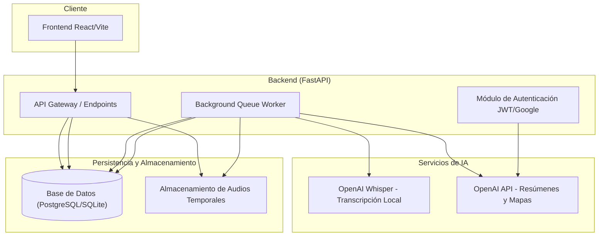
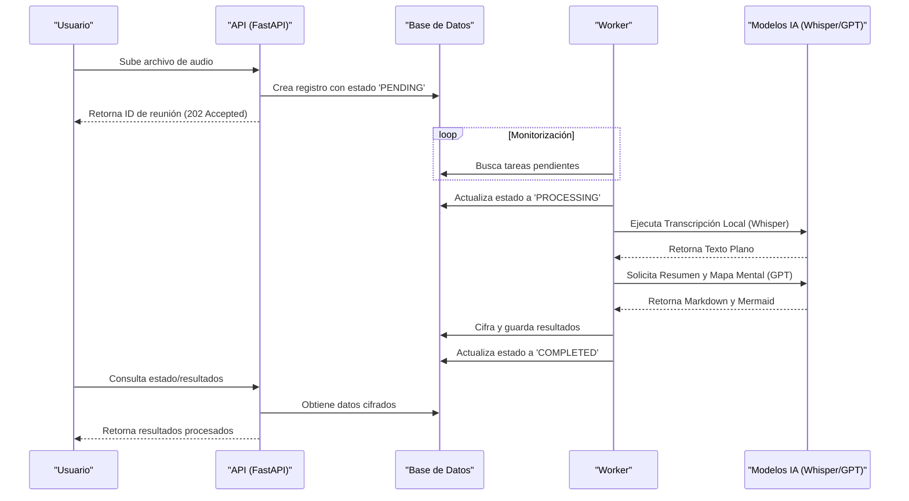

# Arquitectura del Sistema - Bee-Scribe

Este documento detalla la arquitectura técnica, las tecnologías utilizadas y los patrones de diseño implementados en el proyecto Bee-Scribe.

## Descripción General

Bee-Scribe es una plataforma de análisis de reuniones que permite transformar grabaciones de audio en transcripciones, resúmenes estructurados y mapas mentales utilizando Inteligencia Artificial. La arquitectura sigue un modelo cliente-servidor con procesamiento asíncrono para tareas pesadas de procesamiento de lenguaje natural (NLP).

## Diagrama de Arquitectura de Alto Nivel

El siguiente diagrama describe la interacción entre los componentes principales del sistema:

## Capas de la Aplicación

El proyecto se organiza en capas lógicas para facilitar el mantenimiento y la escalabilidad:

### 1. Capa de Presentación (Frontend)
- **Tecnología**: React.js con Vite.
- **Responsabilidad**: Interfaz de usuario, captura de audio, gestión de estados y visualización de resultados (Markdown y Mermaid).
- **Comunicación**: Cliente HTTP (Axios) interactuando con la API REST.

### 2. Capa de Aplicación (Backend API)
- **Tecnología**: FastAPI (Python).
- **Responsabilidad**: Gestión de rutas, validación de esquemas (Pydantic), orquestación de tareas y seguridad.
- **Seguridad**: Implementación de OAuth2 con JWT y soporte para Google Sign-In.

### 3. Capa de Dominio (Servicios)
- **Responsabilidad**: Contiene la lógica de negocio central.
- **Componentes**:
    - **AudioTranscriptor**: Lógica para manejar modelos Whisper locales.
    - **GeneradorResumen**: Ingeniería de prompts para la extracción de puntos clave.
    - **GeneradorMapaMental**: Generación de sintaxis Mermaid a partir de texto.
    - **ChatService**: Contextualización de transcripciones para consultas interactivas.

### 4. Capa de Infraestructura y Datos
- **Responsabilidad**: Acceso a datos, sistemas de archivos y servicios externos.
- **Componentes**:
    - **SQLAlchemy**: ORM para la abstracción de la base de datos.
    - **Cifrado (AES-256)**: Capa de seguridad para datos sensibles en reposo.
    - **OpenAI API**: Proveedor externo para modelos de lenguaje avanzados.

## Flujo de Procesamiento de Audio

El procesamiento se realiza de forma asíncrona para no bloquear la experiencia del usuario:

## Tecnologías Principales

### Backend
- **Python 3.10+**: Lenguaje base.
- **FastAPI**: Framework web de alto rendimiento.
- **SQLAlchemy**: Gestión de base de datos relacional.
- **OpenAI Whisper**: Modelo de reconocimiento de voz para ejecución local.
- **PyJose / Passlib**: Gestión de tokens y seguridad.

### Frontend
- **React**: Biblioteca para interfaces de usuario.
- **Tailwind CSS**: Framework de estilos basado en utilidades.
- **Vite**: Herramienta de construcción y servidor de desarrollo.
- **Lucide React**: Set de iconos optimizado.

## Estrategias de Escalabilidad

El sistema ha sido diseñado pensando en el crecimiento incremental:

### Escalabilidad Vertical
- **Optimización de Memoria**: Uso de generadores en Python para el manejo de archivos de audio grandes.
- **Concurrencia**: Aprovechamiento de `asyncio` y `ThreadPoolExecutor` para manejar múltiples peticiones simultáneas sin bloquear el bucle de eventos.

### Escalabilidad Horizontal
- **Desacoplamiento del Worker**: El procesador de fondo (Worker) puede ejecutarse en instancias separadas de la API, permitiendo escalar la capacidad de procesamiento de audio de forma independiente.
- **Cola de Tareas en DB**: El uso de estados en la base de datos permite que múltiples workers compitan por tareas sin duplicidad (bloqueo optimista).
- **Stateless API**: La API no guarda estado de sesión local (usa JWT), facilitando el despliegue detrás de un balanceador de carga.

## Seguridad

- **Cifrado en Reposo**: Las transcripciones y resúmenes se almacenan cifrados utilizando AES-256 para proteger la privacidad del usuario.
- **Validación de Identidad**: Cada petición a recursos privados requiere un token JWT válido vinculado al ID del usuario.
- **Sanitización**: Validación estricta de tipos de archivos y tamaños para prevenir ataques de denegación de servicio o ejecución remota.
